# Ph Tour Management Frontend 

## 35-1 Project Overview and Objectives
### Tour
- Role Based Authentication
- Admin Add
- User View
### Tech Use
- React+ React router+Ts
- Shadcn+origin Ui
- State Management Redux => RTK Query


## 35-2 Exploring Project Structures: Monorepo vs Polyrepo, Monolith vs Microservices

#### Project Organization
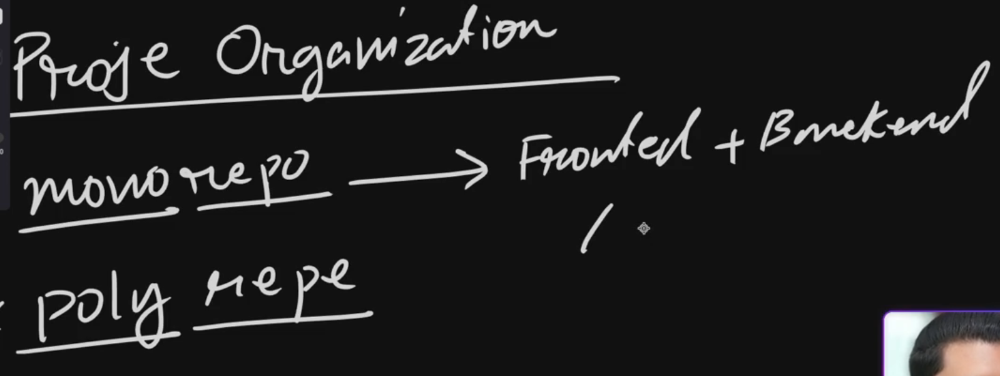
- Mono Repo it means in One Repository frontend and backend
- easier in deployment and others work like Docker
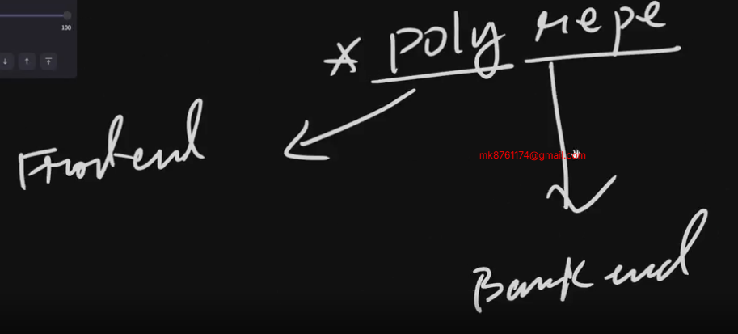
-✅ Poly Repo it Means in One Repo Frontend and Another Repo Backend
- easier for frontend dev and backend dev but some Problem in Deployment

#### Architecture
- Micro Service= Payment , User as small part all part and we give the frontend
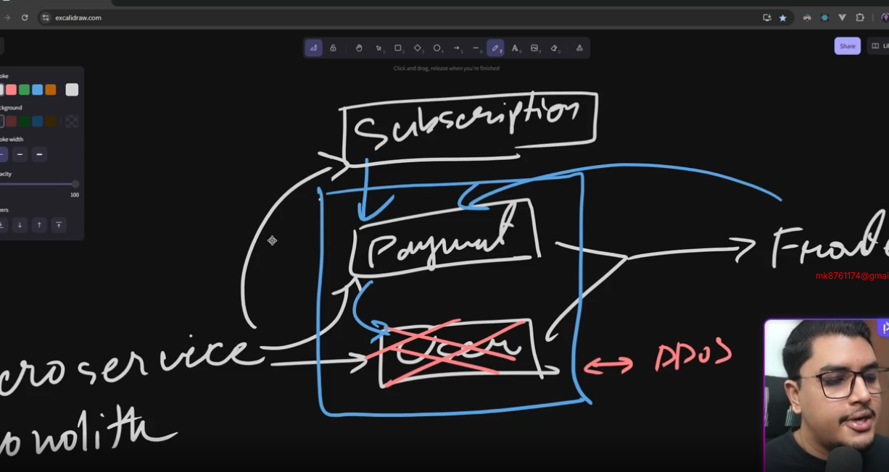
-✅ Monolith
- single codebase
- single database
- single deployment

## 35-3 Selecting the Right Tech Stack for the Project

#### frontend Structure
- 1 Auth =✅ social login (Google) | Customs | ✅Email/Password
 Session based |✅ Token based
- 2 State => Local | (Remote ->Data Fetching)
- 3 View => Row css => Control your But need Huge Time | Material Ui => not Your Control | Sahdcn
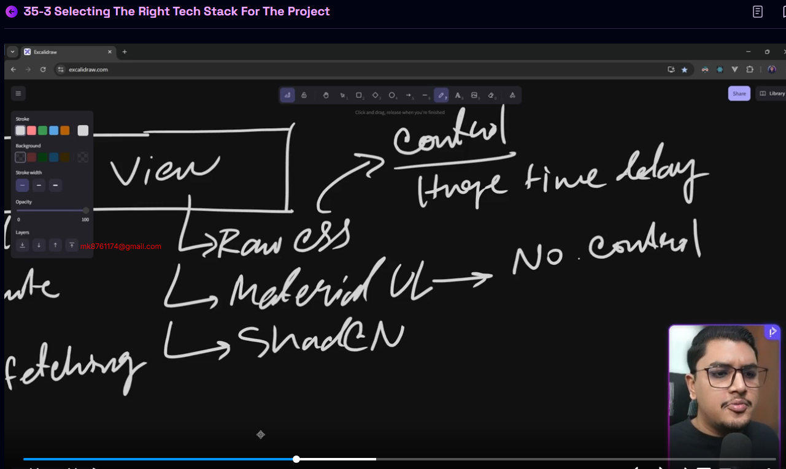
✅ we use React 
- State Management 1 zustand 2 Redux
- Data fetching 1 = RTK Query 2 = TanStack

## 35-4 [optional] Backend Setup and Configuration
- specific Brunch Clone 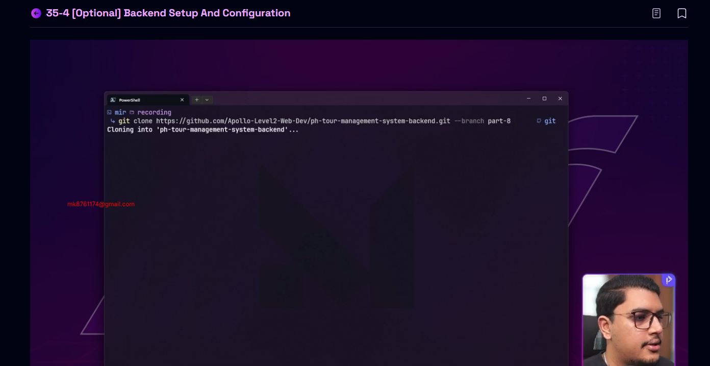
- when you set up new Project must be add env file and run project     \

## 35-5 Introduction to JavaScript Package Managers: npm, Yarn, pnpm, and Bun

- 1 by default save npm = slow and not safe (package Manager)
- 2 yarn create by facebook = faster and safer
yarn 2 version = 1 classic 2 v2+ (package Manager)
- 3 pnpm symlink (package Manager) 
- ✅ 4 Bun package Manager, task Runner ,Ts Supporter, we use it
#### Vite | Frontend Tooling
- We use Vite tooling
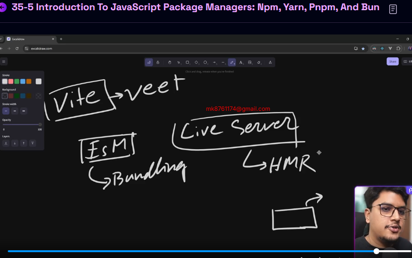

## 36-6 Project Scaffolding with Vite, React, and ShadCN
- first install
```ts
D:\NEXT-LEVEL-2>bun create vite
|
o  Project name:
|  frontend-ph-tour-management
|
o  Select a framework:
|  React
|
o  Select a variant:
|  TypeScript
|
o  Scaffolding project in D:\NEXT-LEVEL-2\frontend-ph-tour-management...
|
—  Done. Now run:

  cd frontend-ph-tour-management
  bun install
  bun run dev


D:\NEXT-LEVEL-2>
```
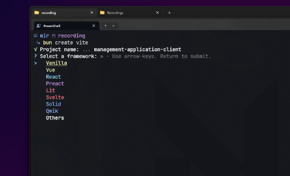

if want install but open administrator window powerShall and this command install bun in your pc
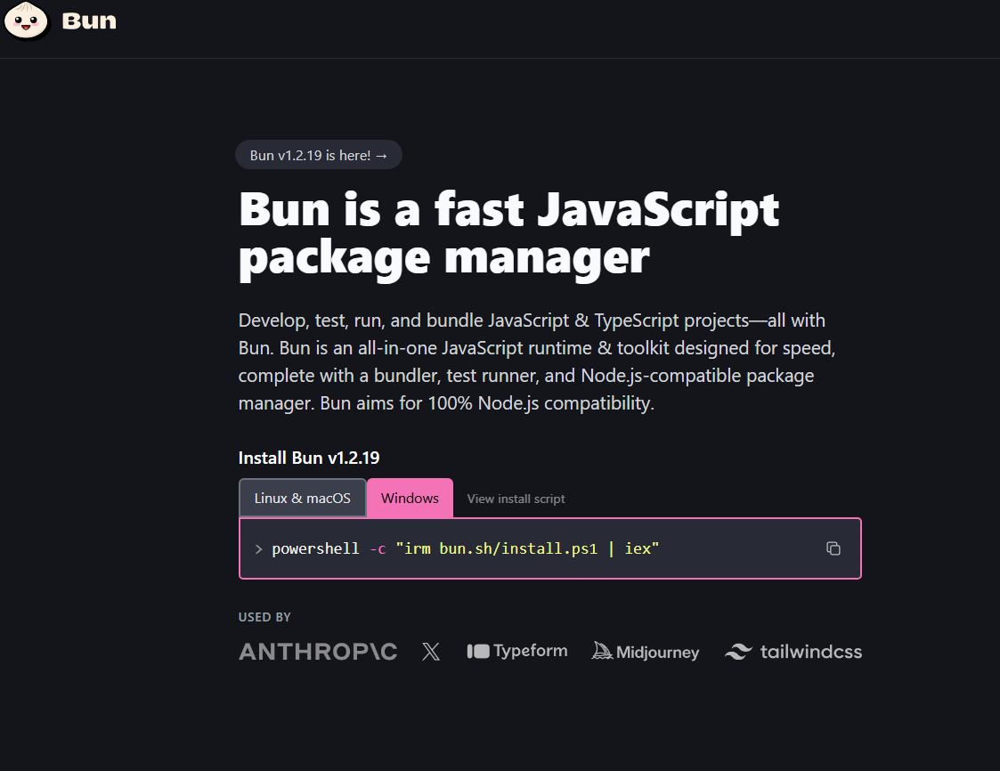

```ts
powershell -c "irm bun.sh/install.ps1 | iex"
```
- Set Up Your Project
```ts
bun add react-router react-hook-form
```
- install follow documents
https://ui.shadcn.com/docs/installation/vite

❌ if You want Re again configaration set up you must delete these file and start again installation 

and you check json file its all ok
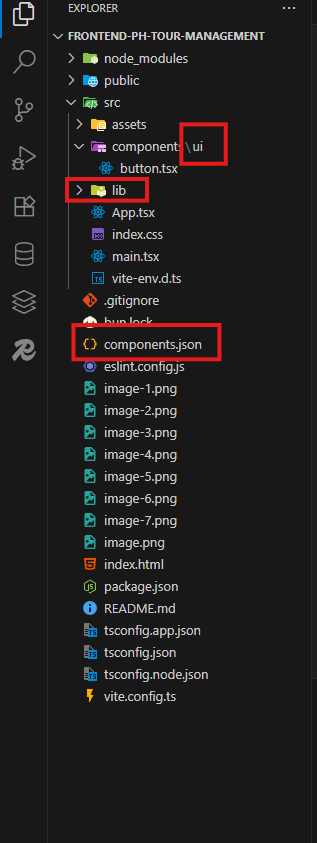


## 35-7 Configuring React Router for Page Navigation
- add Dark Mood Your Server
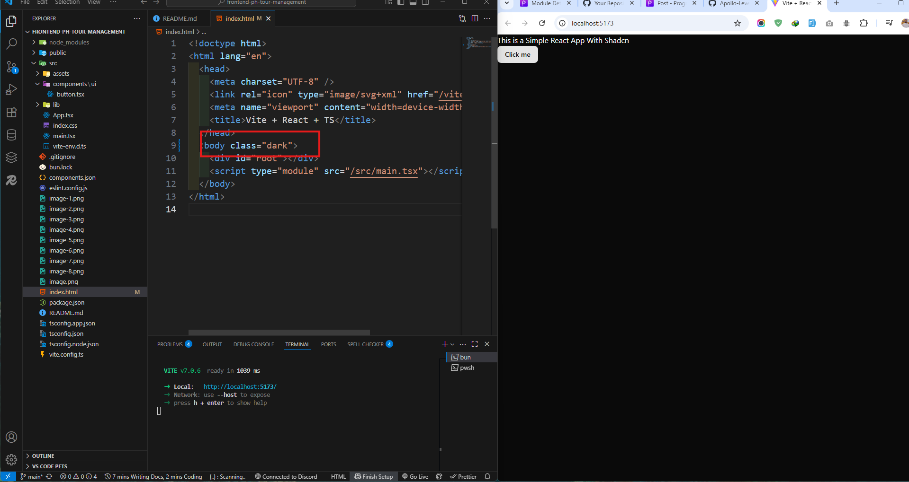

- server port change 
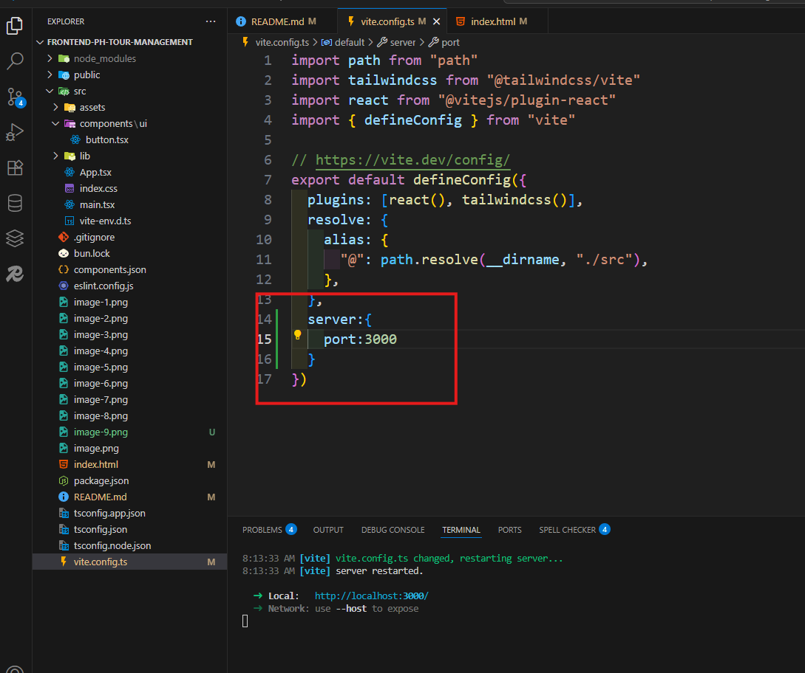

#### Routing set up
- main.tsx
```ts
import App from "@/App";
import About from "@/pages/About";

import { createBrowserRouter } from "react-router";

export const router = createBrowserRouter([
    {
        Component:App,
        path:"/",
        children:[
            {
                Component:About,
                path:"about"
            }
        ]
    }
])
```
- index.tsx
```ts
import App from "@/App";
import About from "@/pages/About";

import { createBrowserRouter } from "react-router";

export const router = createBrowserRouter([
    {
        Component:App,
        path:"/",
        children:[
            {
                Component:About,
                path:"about"
            }
        ]
    }
])
```
- App.tsx
```ts

import { Outlet } from 'react-router'

export default function App() {
  return (
    <div>
      <h1>This is a Simple React App Component</h1>
   <Outlet/>
    </div>
  )
}
```
- About.tsx
```ts
import React from 'react'

export default function About() {
  return (
    <div>
      <h1>About</h1>
    </div>
  )
}
```
## 35-9 Defining Project Folder Structure and Development Methodology

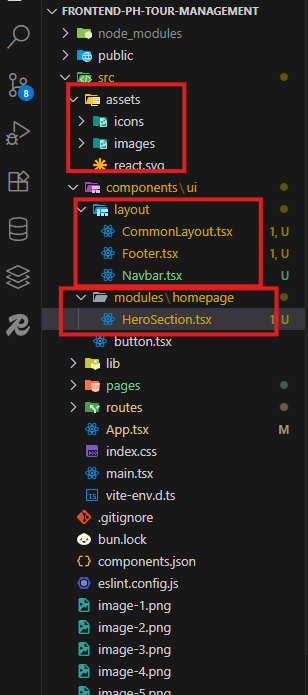
- All Folder Structure
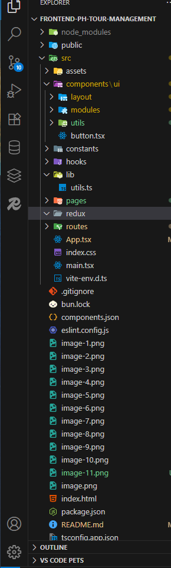
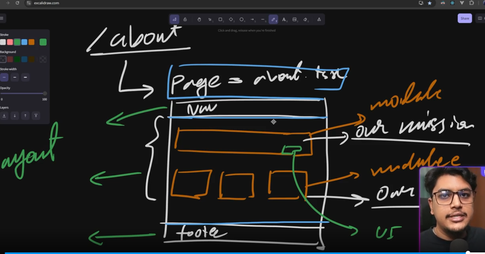

## 35-10 Building Core UI Components: Navbar and Footer with Origin UI and Hyper UI
- originUi https://originui.com/tree  get a navbar from this link

- HyperUi  https://www.hyperui.dev/components/application get a footer from this link

- logoIpsum https://logoipsum.com/ choose logo own choice

## 35-11 Refining Spacing and Alignment for Visual Consistency
- color choose  index.ts because we are use shadcn
- use container and mx-auto  
- commonLayout.ts

```ts
import React, { type ReactNode } from 'react'

import Footer from './Footer'
import Navbar from './Navbar'


interface IProps{
    children:ReactNode
}

export default function CommonLayout({children}:IProps) {
  return (
    <div className='min-h-screen flex flex-col'>
    <Navbar/>
     <div className='grow-1'> {children}</div>
      <Footer/>
    </div>
  )
}
```